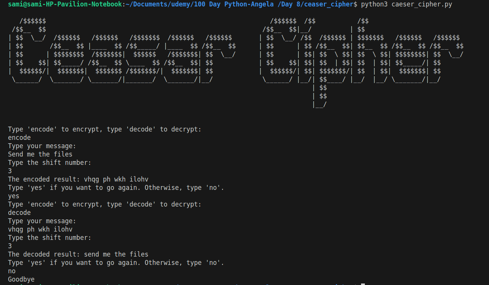

# Caesar Cipher Encryption Tool

🔐 A simple yet powerful text encryption and decryption tool using the classic **Caesar Cipher** algorithm. This Python script allows you to encode and decode messages by shifting letters through the alphabet.

 <!-- Replace with your actual screenshot -->

---

## 📝 Description

This program implements the **Caesar Cipher**, one of the oldest known encryption techniques used by Julius Caesar to protect his military communications.

You can:

- 🔐 **Encrypt** a message with a secret shift number
- 🔓 **Decrypt** an encoded message if you know the shift
- 🔁 Run multiple times without restarting

It handles lowercase letters and preserves spaces, punctuation, and symbols.

---

## 🛠️ Features

- ✅ Encrypt and decrypt text using a custom shift value
- ✅ Wrap-around support (e.g., shifting past 'z' goes back to 'a')
- ✅ Preserves non-alphabetic characters (spaces, commas, etc.)
- ✅ Loop functionality: keep encoding/decoding until you quit
- ✅ Beautiful ASCII art logo for visual flair
- ✅ User-friendly interface with clear prompts

---

## 🚀 How to Use

### 1. Prerequisites

- Python 3.x installed
- Basic understanding of command-line input

### 2. Setup

- Save two files in the same folder:

  - `caesar_cipher.py` → Main script
  - `art.py` → Contains the ASCII art logo
